# 燕山大学2021届软件工程项目毕设简介

[gitee 地址](https://gitee.com/wanxiaoguo/mcf)
[github 地址](https://github.com/antRainZ/mcf)

## 需求分析

### 管理员
系统管理员拥有系统的所有管理权限，能够对系统的资源进行整体的管理。在校园交友平台系统的后台管理系统中主要包括五个模块：系统管理模块、社区版块模块、文章版块模块、日志管理模块和用户管理模块
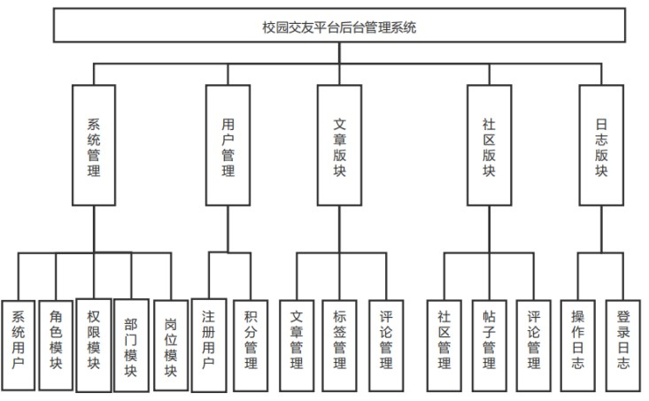

+ (1)系统用户模块：在这个模块里系统管理员可以对后台管理系统的登录用户进行管理，包括添加修改删除用户信息并对用户信息查询等基础功能，同时可以按照部门来查询用户信息，同时可以重置用户的登录密码。
+ (2)角色管理模块：在后台管理系统中对后台的权限和数据权限的控制是比较重要的，系统管理员能够设置数据权限包括全部数据的权限、自定义数据权限两种设置方式。
+ (3)权限管理模块：权限菜单在前台显示是一个权限树结构，顶级权限默认为主菜单，当添加权限菜单时需要会选择一个父级菜单权限，在后台管理系统左侧菜单会根据登录用户相应角色动态显示菜单信息。
+ (4)部门管理模块：在管理员对部门进行管理时，前台渲染的是部门树形结构。添加部门也要选择其父部门，同时能够对部门进行修改、删除、查询操作，能够根据部门名称、部门状态进行搜索。
+ (5)岗位管理模块：管理员能够对校园交友平台系统的岗位模块进行增加、修改、删除、查询等操作，同时能按照岗位的编码、名称、状态进行查询
+ (6)注册用户管理：后台管理员对在校园交友平台系统前台注册的用户进行查看、修改操作，可以通过对用户的姓名模糊查询和用户的大学信息精准查询。同时可以为用户给与积分奖励。
+ (7)文章版块管理：后台系统管理员可以为用户前台首页添加文章，添加文章需要使用富文本编辑方式，还可以为文章设置多个不同的标签，同时设置文章是否有效，当无效时前台用户无法看到文章，同时对文章进行加精操作，对添加的文章进行修改、删除操作，根据文章的标题和创建文章的昵称进行搜索。对于前台用户对文章的评论信息进行管理，可以删除不符合社区要求的帖子，根据相应的文章标题和评论用户昵称对文章评论进行模糊搜索。文章标签管理可以对标签进行增删改查操作，标签主要是用来标识文章一些特征。
+ (8)社区版块管理：在社区版块管理中系统管理员可以对前台用户申请的社区信息进行管理，当前台用户申请新的社区专题时，后台管理员可以先下载查看用户申请社区时提交的申请文件信息，待对申请合理的社区专题给与通过，通过的社区信息将能够显示在前台界面，普通用户就可以查看社区专题信息。对前台用户发布帖子进行查看，对不符合社区规范的帖子进行删除，同时对前台用户发布的帖子评论进行查看，同样对不符合要求的帖子评论进行删除。
+ (9)日志管理：系统管理员可以查看对后台系统的登录日志和操作日志，让管理员对后台系统有个整体的把握。

### 用户需求分析
对于校园交友平台系统而言，普通用户访问的前台系统也非常重要，前台主要分为四个模块首页展示模块、交友大厅模块、社区中心模块、个人中心模块
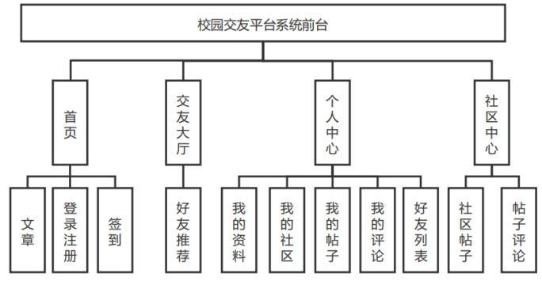

+ (1)用户前台首页展示模块：当普通用户访问前台网站的时候，显示首页内容需要包含后台系统发布的最新文章，和系统管理员在后台管理系统为文章标记的置顶文章。当用户初次登录的时候需要注册账号，通过邮箱发送验证码信息，在通过邮箱注册的时候需要判断系统是否存在该邮箱账号信息。在前台用户忘记登录密码的时候，用户可以通过在校园交友平台系统注册的邮箱账号信息来找回密码。当用户登录成功后，每天可以在首页上完成每天的签到任务，每次签到成功会给用户增加积分。
+ (2)交友大厅模块：用户可以在交友大厅里查看校园交友平台系统注册的有效用户。在用户登录后，再次访问交友大厅的时，后台根据用户自己填写的个人兴趣信息，通过算法计算与其他的用户填写的个人兴趣信息进行匹配，根据匹配结果进行排序然后返回给用户前端。
+ (3)社区中心模块：用户可以在社区中心里查看校园交友平台系统的有效社区内容，点击自己感兴趣的社区查看社区的精彩帖子和最新发布的帖子内容，同时登录用户可以在社区里发布帖子内容，当用户发布的帖子先需要在后台中通过算法判断标题和内容是否存在敏感词信息，系统判断成功的但不先在前台上显示，需要社区内容的管理员进行二次审查通过之后就可以在前台的社区里面查看自己发布的帖子信息。用户可以点击查看自己觉得有趣的社区帖子内容，同时在帖子下面发表自己的意见，但在用户发布的评论信息在前台显示前，需要通过算法判断用户发布的评论内容是否包含一些敏感内容，系统检测通过的内容会显示到帖子下面的评论区里，系统管理员同时也会对一些社区帖子评论信息进行二次审查，审查不通过直接删除掉帖子评论信息。
+ (4)个人中心模块：当用户在前端登录之后可以在个人中心里查看自己个人信息，同时可以读自己的一些个人信息进行修改，也可以修改自己的登录密码。在我的社区子模块可以申请一个社区主题，当系统管理员通过用户的申请之后，用户就可以对社区的内容进行管理，可以发布新的帖子内容，查看该社区主题下所有的帖子详细，对社区里发布的优秀帖子进行加精操作，加精的帖子可以在社区主题页里置顶显示，对其他用户发布的不合格帖子进行删除，合格通过的帖子将可以在社区主题页里进行显示。同时在我的帖子里查看自己的写的帖子，可以删除自己感觉不满意的帖子。在我的评论里查看自己所有的帖子评论，也可以删除掉不好的帖子评论信息。用户在好友列表子模块里查看自己添加的好友，当对方通过自己的申请信息之后双方就可以进行聊天，查看之前历史聊天记录，查看其他人提交的好友申请，并是否通过申请，通过对方的好友申请信息之后，用户就可以与对方进行聊天。用户在聊天时候，在把聊天的信息发送到服务器上，服务器根据某种算法分析用户输入的聊天内容是否包含

# 项目运行

## 导入数据库
在navicat或者sqlyog 新增数据库`mcf`, 并导入数据库文件`sql\mcf.sql`

## 后端项目运行
开发环境:
+ java jdk8
+ redis
+ maven: 3.6.2

运行步骤：
1. idea中导入 `mcf` 项目
2. 修改 `mcf\src\main\resources\application-dev.yml` 文件里的数据库和密码
3. 在 `mcf\src\main\resources\` 目录下新建 `oss.yml`，添加阿里云OSS对象存储的密钥信息
```yml
endpoint:
accessKeyId: 
accessKeySecret: 
bucketName: 
```
4. 运行redis
5. 运行`mcf\src\main\java\org\antrain\MCFWepApp.java` 程序，或者在`mcf`下使用`mvn  spring-boot:run`

### 添加邮箱服务
在 `mcf\src\main\resources\` 目录下新建 `mail.yml`，添加自己邮箱授权信息

```sh
spring:
  # 邮箱注册
  mail:
    #发送邮件服务器
    host: smtp.qq.com
    #发送邮件的邮箱地址
    username: 你的邮箱地址
    # 16位客户端授权码，不是邮箱密码，这个在qq邮箱设置里面自动生成的
    password: 你的授权码
    port: 465
    properties:
      mail:
        smtp:
          ssl:
            enable: true
    default-encoding: utf-8
```

## 后台管理系统运行
开发环境:
+ vscode
+ nodejs: v13.11.0

1. vscode 导入 `mcf-ui` 项目
2. 安装依赖：`npm install --registry=https://registry.npm.taobao.org` 或者使用 `cnpm`
3. 运行：`npm run serve`

## 普通用户前台界面
+ vscode
+ nodejs: v13.11.0

1. vscode 导入 `mcf-user` 项目
2. 安装依赖：`npm install --registry=https://registry.npm.taobao.org` 或者使用 `cnpm`
3. 运行：`npm run serve`

# 系统架构图
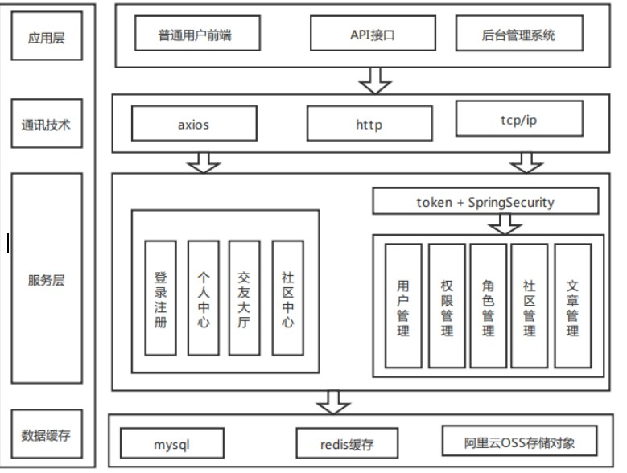

# 数据库设计

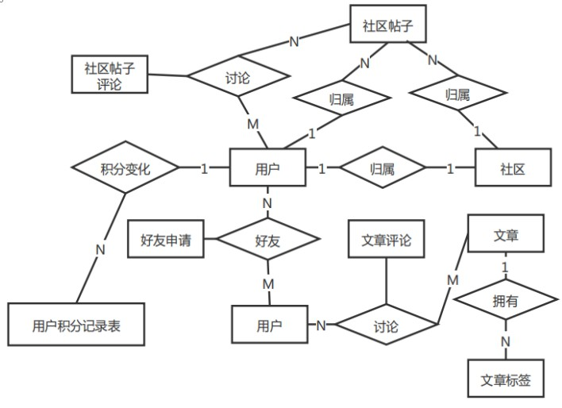

<table>
<tr>
    <td>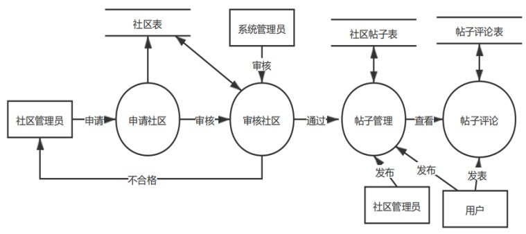</td>
    <td>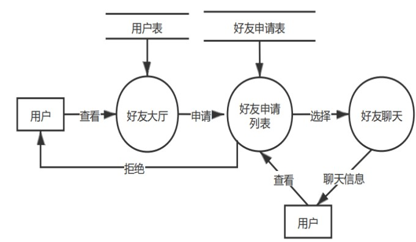</td>
</tr>
</table>

# 运行截图
|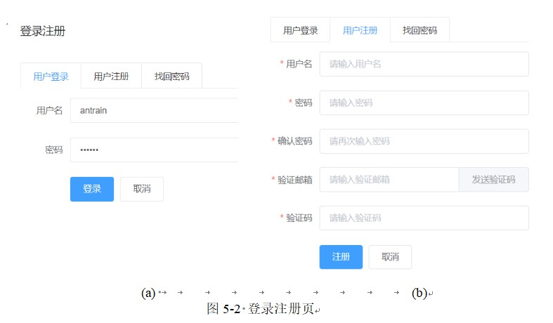  |     |
| --- | --- |
|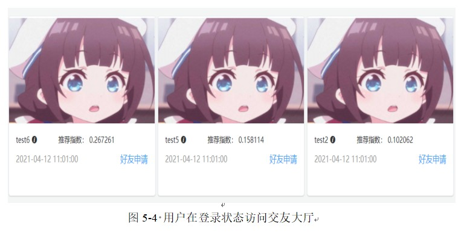  | 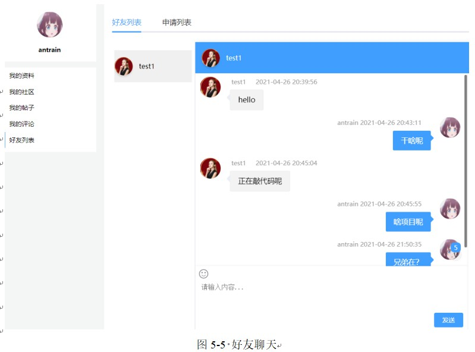    |
|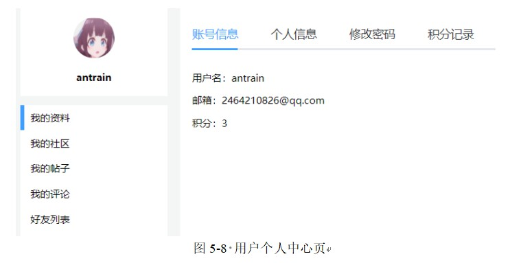  | 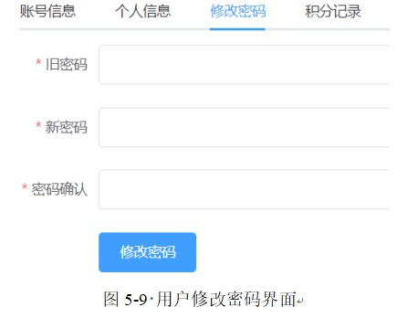    |
|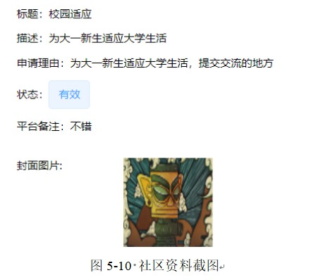  | 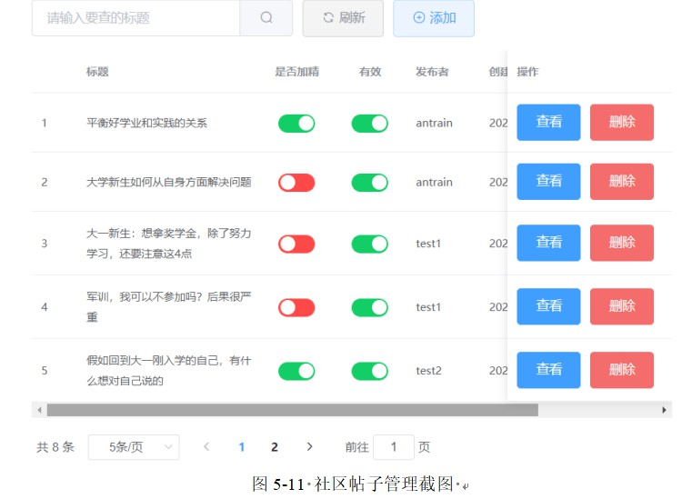    |
|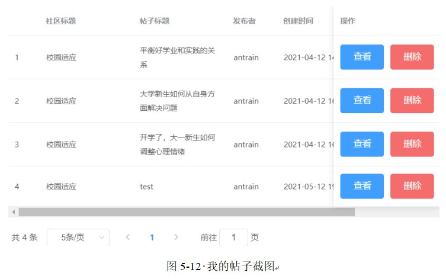  | 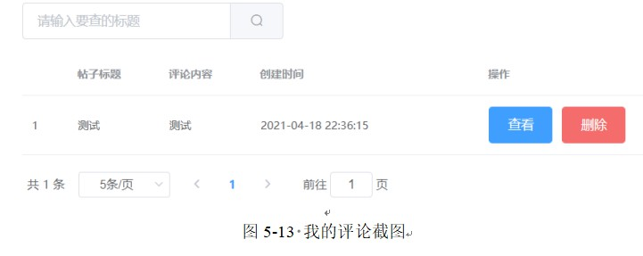    |
|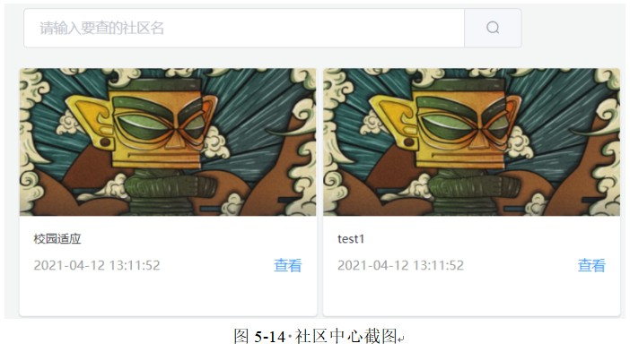  | 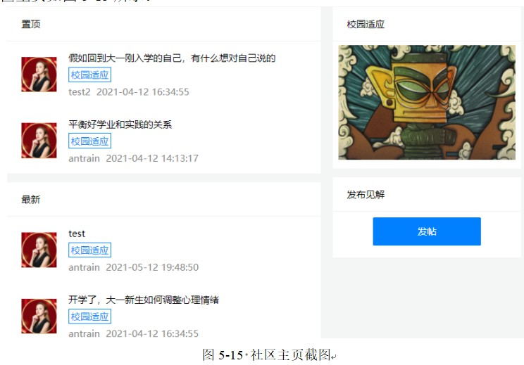    |
|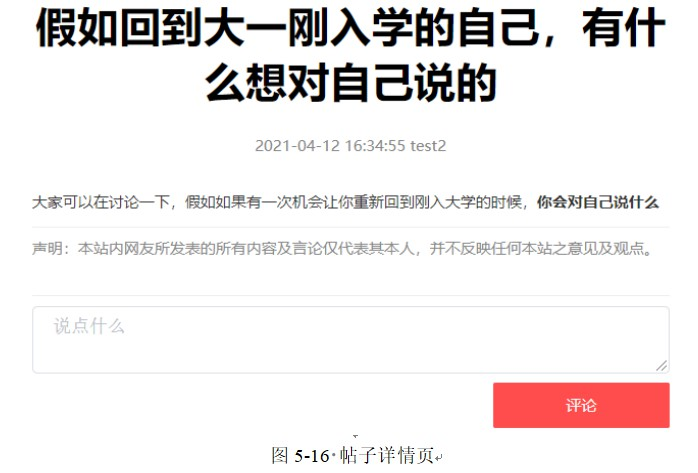  | 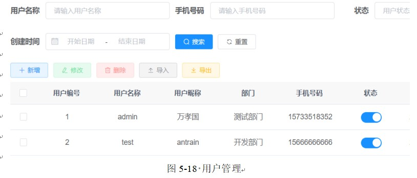    |
|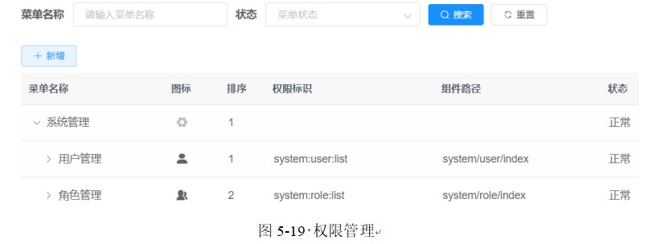  | 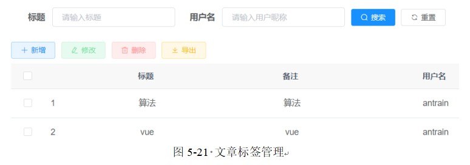    |
|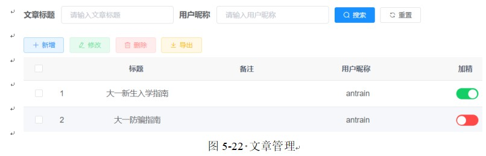  | 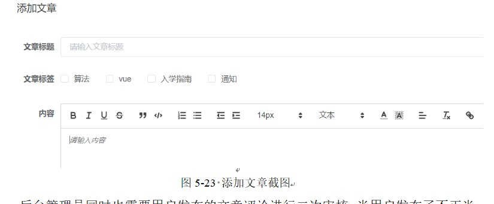    |
|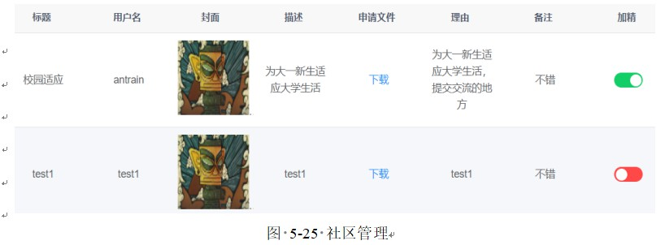  | 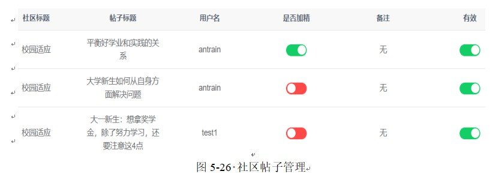    |

# 敏感词过滤
在实现文字过滤的算法中，**DFA(Deterministic Finite Automaton)**是比较好的实现算法，DFA又叫确定有穷自动机。DFA的特征为：有一个有限状态集合和一些从一个状态到另一个状态的有向边，在每条有向边上标记一个符号，在所以的状态集合里其中一个状态是初态，某些状态是终态。但不同于不确定的有限自动机，DFA中不会有从同一状态出发的两条边标志有相同的符号。

通过扫描一遍需要待分析的字符串，就能分析出文本内容是否网站设定的敏感词信息。
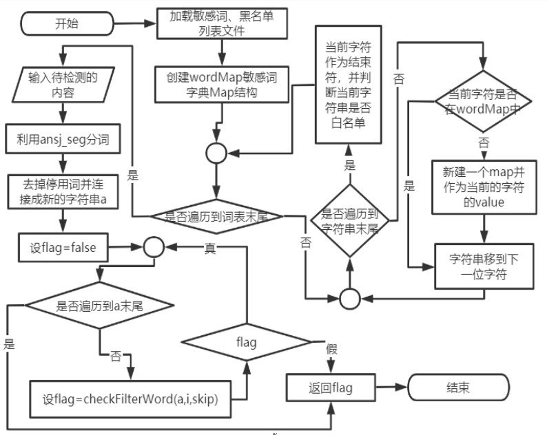

在程序启动的时候，通过Spring的容器管理原理创建一个配置类`WordConfig`，在类上使用`@Configuration注`解，Spring扫描包时扫描到类上配置了@Configuration注解，Spring会把当前类加载到内存中，然后扫描类中的方法是否配置了@Bean注解，当类中的方法配置了该注解会执行该方法，并把执行结果注入到Spring容器中，当其他类需要使用相关类时，通过@Resource注解会从Spring容器中获取相关Bean注入类的属性值。

通过创建WordContext的实例，默认是从类路径下加载`blacklist.txt`黑名单的敏感词列表和`whitelist.txt`白名单词汇列表，因为在某些词汇中的一部分是黑名单的词，比如假设黑名单存在“代理”敏感词，但网站对于“nginx代理”是能够通过的词汇，但直接使用DFA算法会识别出“nginx代理”中的“代理”，然后就把“nginx代理”识别为敏感词。

遍历把读取到的黑名单和白名单词汇通过`addWord`方法加载到`wordMap`敏感词字典中，addWord方法是通过遍历一个敏感词中的每个字符，先把该字符作为key从wordMap读取value，当value为空时表示该字符未加入到wordMap中，所以先创建一个map，并把该map作为该字符的value。当遍历的字符为最后一个字符时，则设置当前位置为结束符，然后当遍历的是白名单的词汇则同时设置该位置为白名单词汇。

当判断一个字符串是否包含敏感词时，从头遍历该字符串，然后以当前位置开始使用`checkFilterWord`方法判断该字符为开始是否存在敏感词，若存在敏感词则提前返回true,不存在则继续往下判断，直到遍历到字符串末尾仍不存在敏感词则返回false。

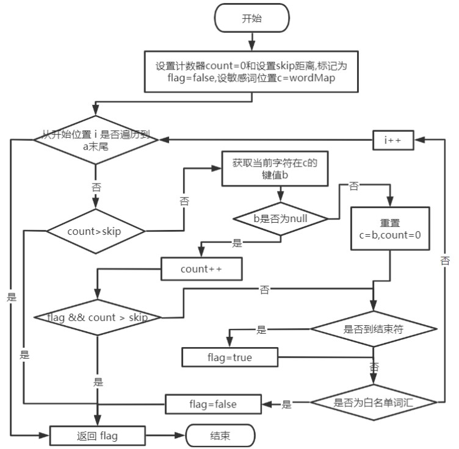

# 基于相似度推荐
利用开源库`ansj_seg`进行中文分词，分词后并去掉停用词，然后根据余弦相似性算法计算相似度在这里需要消耗一点的时间。当用户没有填写个人兴趣信息是会设置相似度的大小为0。

余弦相似度就是通过一个向量空间中两个向量夹角的余弦值作为衡量两个个体之间差异的大小

给定两个文本A和B, $A_i$ 和 $B_i$ 分别表示文本A和文本B在进行中文分词的词频i向量，则文本A和文本B的余弦相似性similarity的计算公式

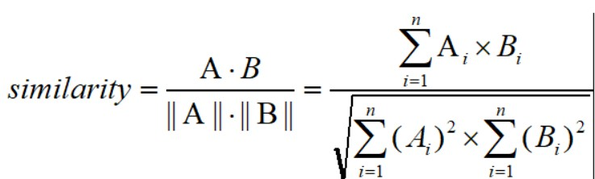

计算两个句子相似度的步骤如下：
+ (1) 通过中文分词，将字符串根据分词算法划分为独立的词集合；
+ (2) 求出两个词集合的并集；
+ (3) 计算各自词集的词频并把词频向量化；
+ (4) 带入余弦相似性similarity向量计算求出两个句子的相似度。